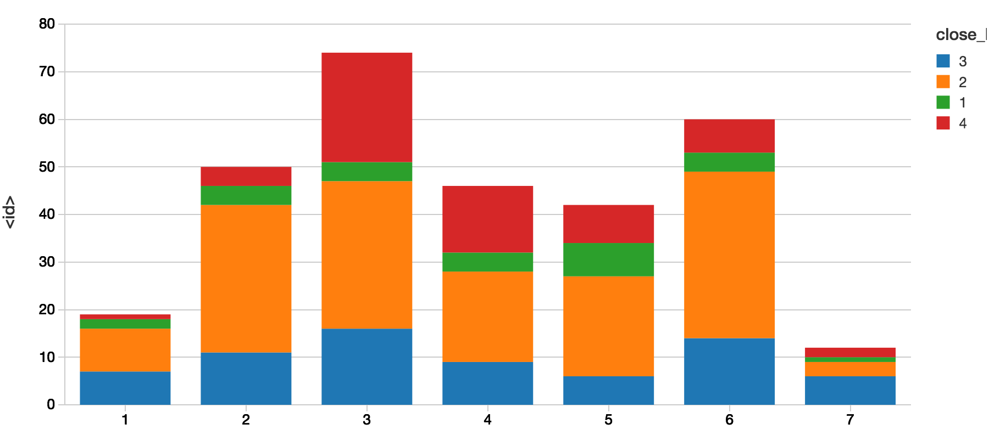
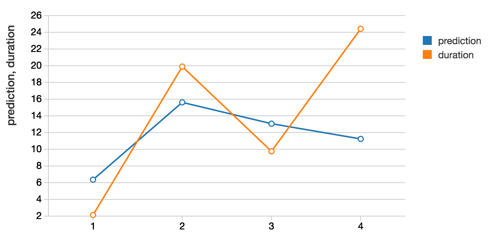
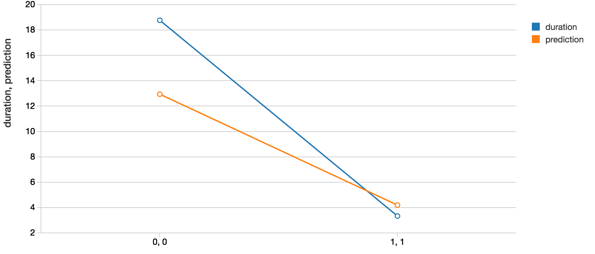

# Gradient Boosted Trees Analysis

## Description
This analysis used the GBT(see references) to make predictions on Todoist history.

## Data Collection
Todoist data was collected via IFTTT job which placed the data in a google sheets.
Initially, this was stored in an every note doc but as the number of rows reached
into the thousands, it quickly became unmanageable.  Data could've also been
collected in a drop box doc without the same scalability issues.  However, google 
sheets had some built in graphical analysis tools already, google sheets was chosen
as the repository.  It also had the extra benefit that any time a file exceeded
2000 rows, it would roll over into another file.  This made data storage a little 
easier however made export/import into databricks some what more troublesome.

## Data Formatting/Munging/Cleaning

### Data Format
Todoist data was organized into both open and closed events organized in a large csv w/ following header:

```
description, project, date/time, tags, priority, link to task w/ id
```

Example:

```
create readme,	Spark,	March 9, 2017 at 08:35AM, any,	Priority 2,	https://todoist.com/showTask?id=123

```

### Field Definitions
- description:  plaintext description of the task
- project: in todoist you can assign tasks to difference projects which can be nested
in a hierarchical structure
- date/time:  timestamp for when the task was 'opened' or 'closed'
- tags:  in todoist you have the option of tagging certain tasks e.g. you might tag as task
on basis of where it can be done such as 'home' or 'work'
- priority:  1-4 where 1 is highest priority
- link to task:  todoist assigns a link and id to a task where the id appears so
far to be unique

### Munging/Cleaning Considerations
- timestamps from ifttt requires a little bit of manipulation to be parsed correctly
- tags and projects need to be [1-Hot Encoded](https://en.wikipedia.org/wiki/One-hot)
otherwise any machine learning algorithm which doesn't recognize categorical differences
will infer an ordering and valuation relationship between categories
- not all tasks have a 1-to-1 mapping between open and closing i.e. some tasks 
may be deleted w/o being closed
- recurring tasks have the same id and therefore have multiple close events

### Calculating Task Duration
Duration is calculated by a join of the id's between open and close events(excepting 
recurring events) and then taking the date difference between the two.

### Note on Incentive Tags
Certain tags are 'incentives' which incur a small reward when completed.  I wanted 
to see if incentives had any effect on duration.

## Gradient Boosted Trees
- used the stock spark mllib gbt
- configuration:  gbt contains a heuristic to determine which columns are categorical vs numerical values.
For this analysis, this was ignored in favor of OHE.
- depth of 10-30
- iteration of 10-200
- regression of RMSE(Root Mean Squared Error) on test data
- 70/30 split training/test data

## Results
- RMSE:  8% on tested data
- Number of tasks completed by day of week and priority:

- Effect of priority on duration both predicted and actual(x-axis:  priority, y-axis:  duration):

- Effect of incentivization on duration(x-axis:  open/close incentive, y-axis:  duration)


## Conclusions
Learned some pretty interesting things about my personal productivity.  Both actual and predicted seem to
indicate a positive correlation between incentive an decreased duration.  There is some 
inherent bias as this data is self-reported.  Some of the predictions seem to validate some 
of the intuitive assumption e.g. less tasks get completed on the weekends or that high priority
tasks take a shorter amount of time.

## References
- [Gradient Boosted Trees](https://en.wikipedia.org/wiki/Gradient_boosting)
- [1-Hot Encoded](https://en.wikipedia.org/wiki/One-hot)


